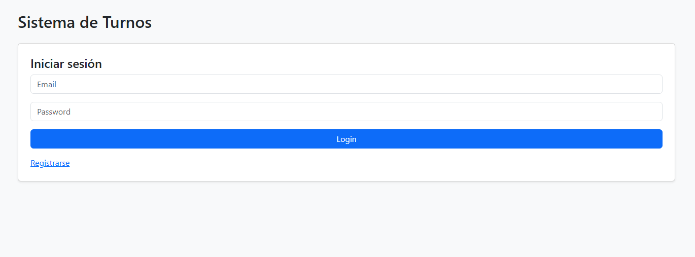
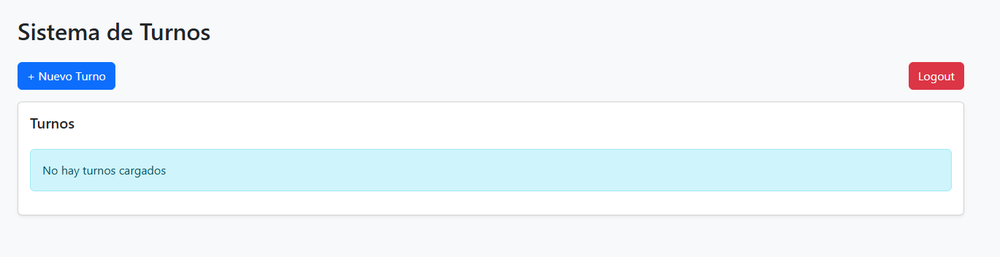
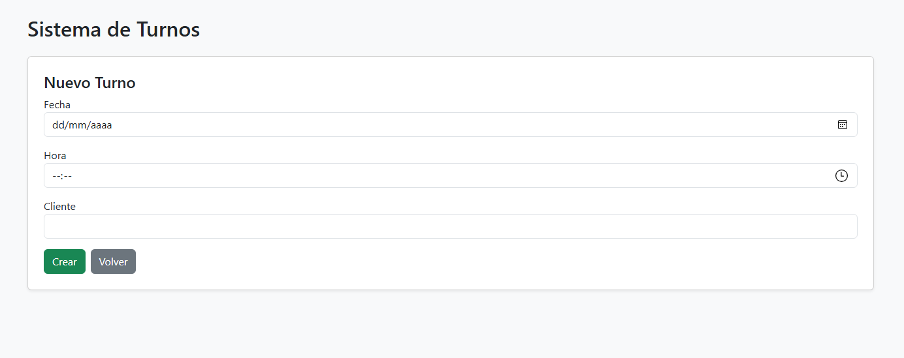
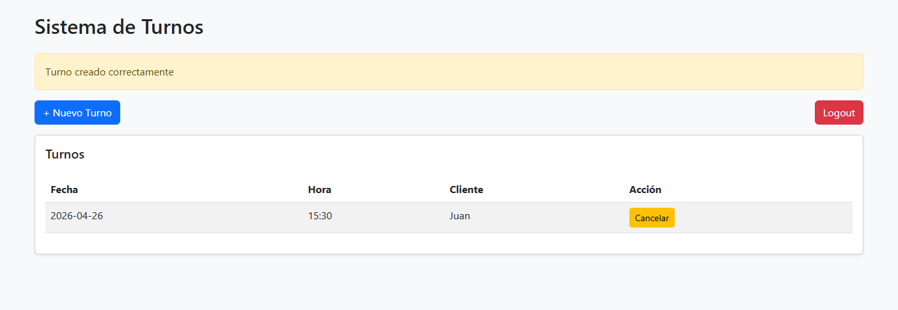

# Sistema de Gestión de Turnos – Demo

Aplicación web para gestionar turnos de forma simple, pensada para pequeñas empresas como peluquerías, consultorios y negocios con atención por agenda.

---

## Demo

Este proyecto incluye una demostración en video donde se muestra el flujo completo del sistema:

- Login de usuario
- Creación de turnos
- Validaciones
- Cancelación de turnos

Ver demo: https://youtu.be/yyst78xs7cU

---

## Funcionalidades

- Registro y login de usuarios
- Creación de turnos
- Cancelación de turnos
- Validación de horarios duplicados
- Restricción de fechas pasadas
- Roles de usuario (admin / usuario)
- Visualización ordenada de turnos
- Mensajes de validación al usuario

---

## Tecnologías

- Python
- Flask
- SQLite
- SQLAlchemy
- Flask-Login
- HTML + Bootstrap

---

## Personalización

El sistema puede adaptarse según las necesidades del negocio:

- Configuración de horarios
- Tipos de servicio
- Múltiples usuarios
- Integraciones (WhatsApp, email)
- Reportes

Cada implementación puede ajustarse a los procesos del cliente.

---

## Cómo ejecutar el proyecto

```bash
git clone https://github.com/tefadominguez/turnos-app.git
cd turnos-app
python -m venv venv
venv\Scripts\activate
pip install -r requirements.txt
python run.py
```

Abrir en navegador:
http://127.0.0.1:5000

---

## Capturas

### Login


### Dashboard


### Crear Turno


### Turno creado


---

## Estado del proyecto

Este proyecto es una versión demo pensada para portfolio y presentación.

Puede evolucionar fácilmente a una solución completa para uso real en negocios.

---

## Contacto

Para consultas o implementaciones personalizadas:

stefanodominguez@hotmail.com